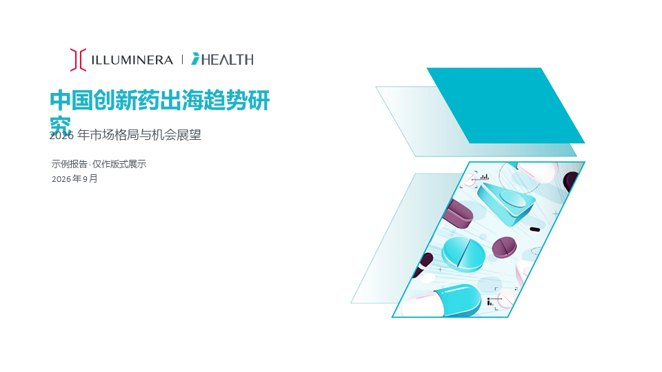
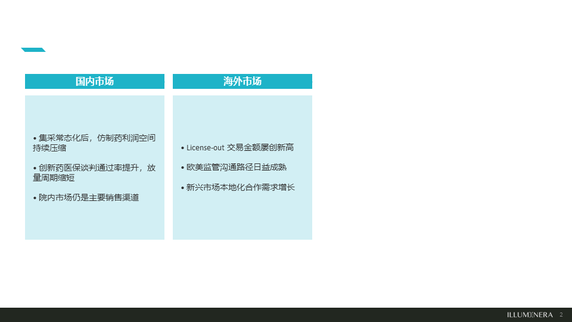
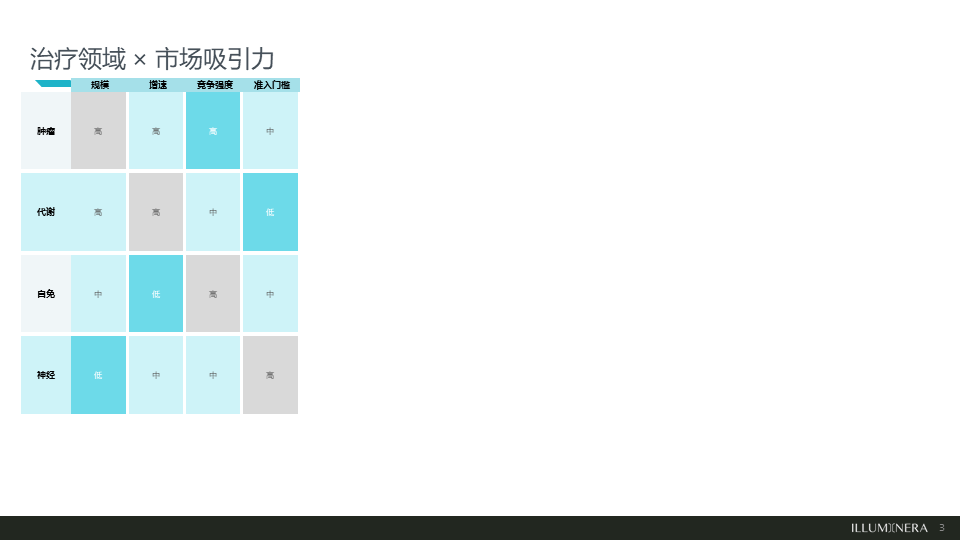
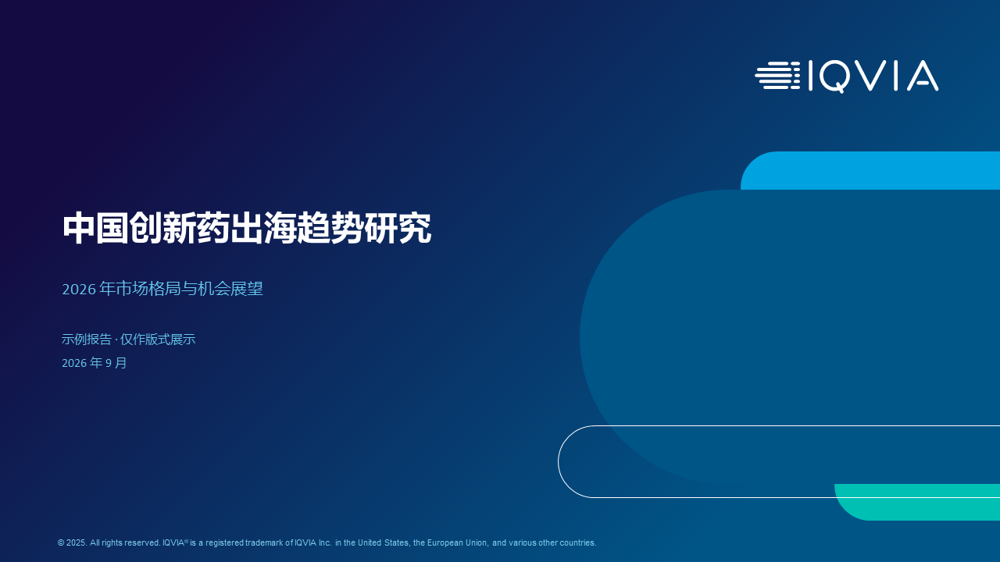
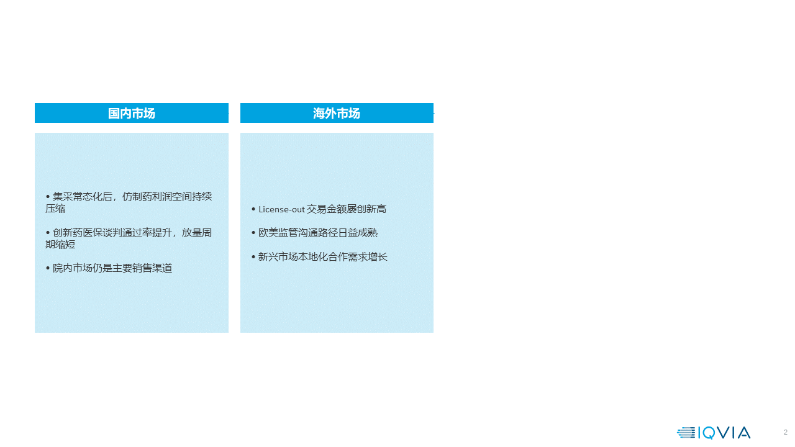
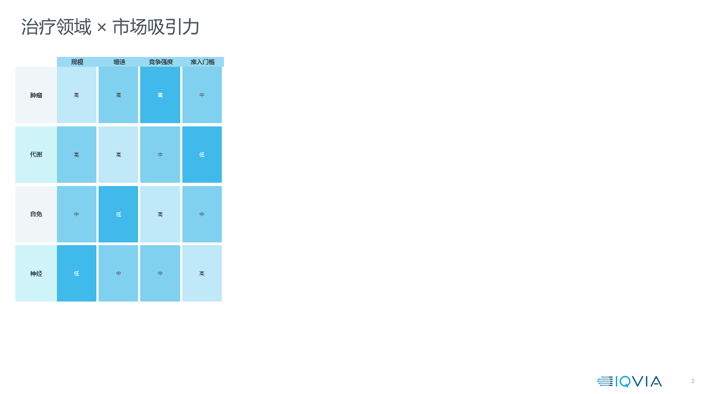

# pptx-consulting-report

把 PPT 草稿 / 文字稿一键变成咨询风格成品演示文稿的 **AI Skill**（AI 助手扩展技能）。

面向人群：**咨询顾问、行业研究员、医药市场团队** —— 不需要懂编程，只要会让 AI 助手"干活"就能用。

---

## 它能帮你做什么

把下面任意一种输入，自动变成 ILLUMINERA（青色）或 IQVIA（深蓝）风格的成品 PPT：

| 场景 | 例子 |
|---|---|
| 中文草稿 → 全英文成品 | "把这份中文 PPT 翻译成英文咨询报告" |
| 乱版式 → 统一咨询风格 | 同事的草稿页风格杂乱，重排成统一模板 |
| 文字稿 → 直接生成 PPT | 把 markdown / Word 文字稿做成成品演示文稿 |

成品特点：

- **全元素原生可编辑**：文本框、形状、表格都是真 PPT 元素，不是贴图，客户随时能改
- **一页一论点**：自动按 action title + 论据组织页面
- **13 套版式自动匹配**：对比页、矩阵表、流程图、图表洞察、总结页等
- **中英互译**：内置医药咨询术语表（科室=department、集采=VBP 等），品牌名/药品名/方案编号自动保留不译
- **自动质检**：渲染截图 + 文字溢出/越界检测，发现问题自动修复

## 效果展示

同一内容分别用两套模板生成（示例数据为虚构，仅作版式展示）：

**风格 A：ILLUMINERA 青**

| 封面 | 双栏对比（F07） | 矩阵热力表（F08） |
|---|---|---|
|  |  |  |

**风格 B：IQVIA 深蓝**

| 封面 | 双栏对比（F07） | 矩阵热力表（F08） |
|---|---|---|
|  |  |  |

> 以上样张由 `examples/make_samples.py` 一键生成，你也可以运行它自行验证安装是否成功。

## 你需要准备什么（环境清单）

| 依赖 | 是否必须 | 说明 |
|---|---|---|
| 支持 Skills 的 AI 助手 | **必须** | 例如 Kimi Work 桌面版，或任何支持自定义 Skill 目录的 Agent（Claude Code、Cursor 等） |
| Python 3.12+ | **必须** | 生成 PPT 的引擎是 python-pptx；Kimi Work 托管 Python 已自带，无需安装 |
| OfficeCLI | 推荐 | 用于渲染截图做视觉质检。Kimi Work 已内置；独立安装：`npm install -g officecli` |
| svglib + rlPyCairo | 可选 | 仅"SVG 图标转 PNG"时需要，Kimi Work 托管 Python 已自带 |
| Git | 仅下载时需要 | 或直接点 GitHub 页面的 "Code → Download ZIP" |

> **Windows 用户提示**：在 Git Bash 中使用 OfficeCLI 前，先执行
> `export PATH="/d/KimiData/daimon-share/daimon/npm-global:$PATH"`
> （把路径中的盘符换成你本机 Kimi Work 的实际安装盘符）。没有 OfficeCLI 也能生成 PPT，只是少了自动质检截图这一步。

## 安装方法

### 方法一：Kimi Work 用户（推荐）

1. 从 GitHub 下载本仓库 ZIP 并解压，得到 `pptx-consulting-report` 文件夹
   （注意：文件夹内部的结构必须保持 `SKILL.md` 在根上，`scripts/`、`assets/` 是它的子文件夹）
2. 把整个文件夹复制到 Kimi Work 的技能目录：
   `D:\KimiData\daimon-share\daimon\skills\pptx-consulting-report\`
   （如果你的 Kimi Work 装在别的盘，把 `D:` 换成实际盘符）
3. 重启 Kimi Work（或新开一个会话），技能列表里就会出现 `pptx-consulting-report`

### 方法二：其他支持 Skill 的 Agent（Claude Code / Cursor 等）

把 `pptx-consulting-report` 文件夹放到该 Agent 的 skills 目录下，保证 SKILL.md 位于 `<技能目录>/pptx-consulting-report/SKILL.md` 即可。Agent 启动时会自动加载其中的说明与脚本。

### 验证安装

新开一个会话，对 AI 助手说：

> 用 pptx-consulting-report 帮我做一页对比版式的样张

如果它开始询问你的内容或模板偏好，说明安装成功。

## 怎么用

安装后不需要记任何命令，直接用自然语言吩咐 AI 助手即可。常用话术：

```
用 pptx-consulting-report 把这个 PPT 转成全英文成品，IQVIA 深蓝风格
```
```
这份 markdown 是我报告的文字稿，帮我做成咨询风格 PPT，用 ILLUMINERA 模板
```
```
把这份草稿重排一下，版式统一，中文部分翻译成英文，术语按医药咨询惯例
```

AI 助手会自动完成：内容理解 → 版式匹配 → 页面构建 → 质检 → 交付成品 `.pptx`（命名如 `原文件名_EN.pptx`）。

### 进阶提示

- **风格选择**：默认 ILLUMINERA 青；说"IQVIA 风格"即切换深蓝模板
- **只翻译不重排**：如果原稿版式已经合规，助手会走"保险路径"只替换文字、不动版式
- **术语修正**：翻译结果不满意时，直接告诉助手"科室统一译成 department"，它会更新翻译记忆（存在 `assets/translation_maps/`，可复用）

## 目录结构

```
pptx-consulting-report/
├── SKILL.md            # 给 AI 助手看的使用说明书（核心）
├── scripts/            # 构建/检查/翻译脚本（Python）
│   ├── builders.py         # 13 个版式族的页面构建器
│   ├── inspect_deck.py     # 解析输入 PPT 的内容结构
│   ├── translate_deck.py   # 按翻译映射替换文本
│   ├── qa_render.py        # 渲染截图供质检
│   └── extract_slide_spec.py
└── assets/             # 模板与设计资产
    ├── template_illum.pptx   # 风格 A：ILLUMINERA 青模板
    ├── template_iqvia.pptx   # 风格 B：IQVIA 深蓝模板
    ├── design_system.json    # 设计令牌（颜色/字号）
    ├── 版式目录.md / 版式规格.md  # 13 个版式族的规格说明
    ├── translation_maps/     # 翻译记忆
    └── icons/                # 图标
```

## 常见问题（FAQ）

**Q：我完全不懂技术，能用吗？**
能。所有技术操作都由 AI 助手完成，你只需要像吩咐实习生一样用中文描述需求。

**Q：必须装 OfficeCLI 吗？**
不是。它只负责"渲染截图做质检"。没有它助手照样能生成 PPT，只是质检环节会变成纯逻辑检查，建议生成后自己翻一遍页面。

**Q：生成出来的 PPT 可以在 PowerPoint / WPS 里继续编辑吗？**
可以。所有元素都是原生文本框、形状和表格，母版来自两套模板文件。

**Q：翻译术语不符合我们公司的惯例？**
直接在对话里告诉助手正确的译法，它会记住并存入 `assets/translation_maps/`，下次自动沿用。

**Q：页面文字太多放不下怎么办？**
助手内置容量规则（单页 ≤6 条要点、每条 ≤2 行），超出会自动拆页；成品 QA 发现溢出时会自动降字号或拆页并复检。

**Q：Windows 上 officecli 提示"命令找不到"？**
在 Git Bash 里先执行 README 上方"Windows 用户提示"中的 `export PATH=...` 命令。

## 许可与声明

- 本仓库代码以 MIT 协议开源
- `assets/` 中的 `template_illum.pptx`、`template_iqvia.pptx` 为参考两家咨询公司公开报告视觉风格制作的模板，**版权与商标归原公司所有**，仅供内部学习与交流使用，请勿商用或冒充官方出品
